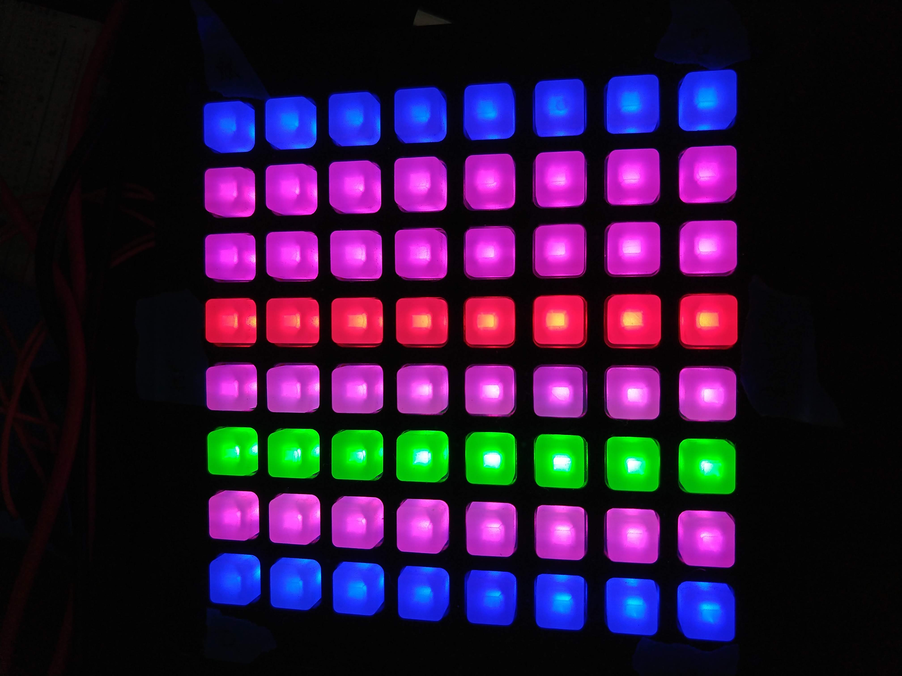

# Grid-MIDI-Controller
MIDI Controller inspired by Ableton Push/Novation Launchpad.

## Overview

- Parts
	- Arduino Uno
	- [Trellis Pad](https://www.adafruit.com/product/3954) x 4
	- Buttons x 2
	- MIDI jack
	- Resitors

- Display Modes
	- Chromatic scale mode
		- You have all the notes available but the notes in the selected scale are highlighted.
		
	- Selected scale mode
		- You only have the notes in the scale available to you.
		
	- Setting mode
		- This is where you can pick your key, octave, scale, and chord.
		

- Playback Modes
	- Notes
		- Plays back only the note that you pushed.
	- Chords
		- Plays back the chord you have selected in the setting using the note you pushed and the root.
